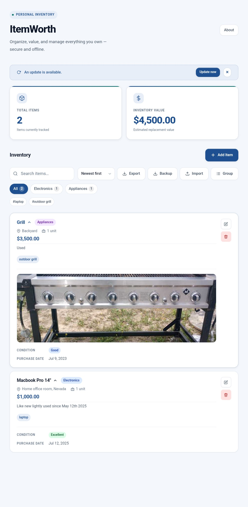
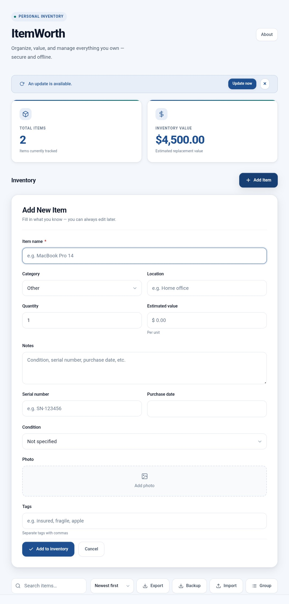

# ItemWorth

> **A private, offline-first home inventory app for organizing, documenting, and estimating the value of personal belongings.**

## Try ItemWorth

### **[Launch the live app](https://offgrid-apps.github.io/ItemWorth/)**

**No account · No subscription · No cloud database · Works offline**

[](https://offgrid-apps.github.io/ItemWorth/)

ItemWorth helps people create a dependable record of their belongings for personal organization, insurance documentation, moving preparation, estate planning, and general asset management.

Inventory information is stored locally in the browser rather than being sent to an ItemWorth server.

## Why ItemWorth

- Works without an Internet connection after the app has loaded or been installed
- Requires no account or subscription
- Uses no backend, remote database, or cloud inventory service
- Stores inventory data locally in the browser
- Supports detailed item records and photos
- Provides JSON backup and restoration
- Provides CSV export
- Is installable as a Progressive Web App
- Is designed for mobile use and accessibility
- Uses a color-blind-friendly visual system

**Start immediately without registering or providing personal information.**

[Launch ItemWorth](https://offgrid-apps.github.io/ItemWorth/) ·
[View releases](https://github.com/OffGrid-apps/ItemWorth/releases) ·
[Report a problem](https://github.com/OffGrid-apps/ItemWorth/issues/new?template=bug_report.yml) ·
[Suggest an improvement](https://github.com/OffGrid-apps/ItemWorth/issues/new?template=feature_request.yml)

---

## Important Data Notice

ItemWorth stores inventory data in the current browser profile using `localStorage`.

Clearing browser data, resetting the browser, uninstalling the browser, changing devices, or losing access to the current browser profile may remove locally stored inventory information.

**Create regular JSON backups and keep those backup files in a safe location.**

ItemWorth does not automatically synchronize information between devices.

---

## Screenshots

### Inventory Dashboard


The dashboard provides a clear overview of the inventory, including item count, estimated total value, search, sorting, backup, restoration, export, and grouping controls.

### Add New Item



Create detailed inventory records with categories, quantities, estimated values, conditions, serial numbers, purchase dates, locations, notes, tags, and photos.

---

## Core Features

### Inventory Management

- Add inventory items
- Edit existing items
- Delete items with confirmation
- Organize items by category
- Record storage locations
- Track quantities
- Record estimated values
- Add notes
- View total item count
- View estimated total inventory value

### Detailed Item Records

- Item name
- Category
- Location
- Quantity
- Estimated value
- Serial number
- Purchase date
- Condition
- Notes
- Tags
- Item photo
- Created date
- Expandable item details

### Search and Organization

- Search inventory records
- Filter by category
- Sort inventory
- Group items
- View dashboard statistics
- Track running inventory totals
- View empty and no-results states

### Backup and Export

- Export a complete JSON backup
- Preserve item identifiers and supported item fields
- Restore inventory from a JSON backup
- Access restoration when the inventory is empty
- Export inventory data as CSV
- Maintain compatibility with earlier supported inventory records

### Progressive Web App

- Installable on supported devices and browsers
- Offline operation
- Service Worker support
- Cached application resources
- Update notifications
- Mobile-oriented interface

### Reliability

- Storage availability checking
- Recovery screen when browser storage is blocked
- Storage-quota error handling
- Protection against uncaught storage failures
- Clear user-facing status messages
- Backward-compatible inventory loading

---

## Typical Uses

ItemWorth can help with:

- Home inventory documentation
- Personal organization
- Insurance preparation
- Moving preparation
- Estate planning
- Asset tracking
- Storage organization
- Recording serial numbers
- Documenting item condition
- Maintaining replacement-value estimates

ItemWorth does not provide professional appraisals, insurance coverage decisions, or legal valuations. Estimated values are entered and maintained by the user.

---

## Getting Started

1. Open the [ItemWorth live app](https://offgrid-apps.github.io/ItemWorth/).
2. Select **Add Item**.
3. Enter the information you want to preserve.
4. Save the item.
5. Repeat for additional belongings.
6. Use search, categories, sorting, and grouping to organize the inventory.
7. Select **Backup** to create a JSON backup.
8. Store the backup file somewhere safe.

No account setup is required.

---

## Installing ItemWorth

ItemWorth can be installed as a Progressive Web App on supported browsers.

1. Open the [live app](https://offgrid-apps.github.io/ItemWorth/).
2. Open the browser menu.
3. Select **Install app**, **Add to Home screen**, or the equivalent option shown by the browser.
4. Confirm the installation.

The exact wording depends on the device and browser.

After installation, ItemWorth can be opened from the device home screen and used offline.

---

## Privacy

ItemWorth is intentionally client-only.

The application does not require:

- A user account
- Authentication
- A subscription
- A backend server
- A remote inventory database
- Cloud storage
- Environment variables
- An Internet connection for normal inventory management after loading

Inventory information remains in the current browser profile unless the user deliberately exports, copies, shares, or removes it.

Because GitHub Issues are public, never include private inventory information in a bug report or feature request.

Do not publicly post:

- JSON backup files
- Complete inventory lists
- Serial numbers
- Receipts
- Exact storage locations
- Home addresses
- Private photographs
- Sensitive notes
- Other personally identifying information

---

## Feedback and Support

ItemWorth uses GitHub Issues for structured bug reports and feature requests.

Submitting an issue requires an Internet connection and a GitHub account.

- **[Report a problem](https://github.com/OffGrid-apps/ItemWorth/issues/new?template=bug_report.yml)**
- **[Suggest an improvement](https://github.com/OffGrid-apps/ItemWorth/issues/new?template=feature_request.yml)**
- **[View existing issues](https://github.com/OffGrid-apps/ItemWorth/issues)**
- **[View releases](https://github.com/OffGrid-apps/ItemWorth/releases)**
- **[Open the live app](https://offgrid-apps.github.io/ItemWorth/)**

For installation, offline, storage, or data-persistence problems, include:

- Device model
- Operating-system version
- Browser name and version
- Whether ItemWorth was installed
- Whether the problem occurs online, offline, or both
- Clear reproduction steps
- The expected result
- The actual result

Do not attach private inventory data.

---

## Vision

ItemWorth aims to provide a dependable, privacy-focused inventory solution that is fast, intuitive, accessible, and maintainable without requiring accounts, subscriptions, cloud storage, or servers.

The project prioritizes long-term stability, data portability, and practical usefulness over unnecessary feature growth.

---

## Core Principles

- Offline-first
- Privacy-first
- Local-first
- Mobile-first
- Accessibility-first
- Color-blind friendly
- Lightweight
- Fast
- Reliable
- Maintainable
- Backward compatible
- Incrementally developed

Every product and engineering decision should reinforce these principles.

---

## Technology Stack

ItemWorth intentionally uses a small technology stack:

- React 19
- Vite 8
- JavaScript with ES modules
- `vite-plugin-pwa`
- Workbox
- HTML5
- CSS3

Persistent storage:

- Browser `localStorage`

Current inventory storage key:

```text
itemworth.inventory.v1
```

---

## Architecture

ItemWorth is a client-side React application.

There is:

- No backend
- No application server
- No remote database
- No authentication system
- No cloud inventory storage
- No required external application API
- No environment-variable configuration

Inventory operations take place in the browser.

The application architecture is intentionally small to reduce maintenance requirements, deployment complexity, and long-term failure points.

---

## Accessibility

Accessibility is a core project requirement.

The interface aims to provide:

- Semantic HTML
- Native controls where appropriate
- Keyboard-accessible interactions
- Screen-reader-conscious labels and status messages
- Visible focus states
- Large touch targets
- Responsive mobile layouts
- Reduced-motion support
- Color-blind-friendly visual distinctions
- Information that does not rely exclusively on color

Accessibility is reviewed as part of feature development and release verification.

---

## Offline Philosophy

Offline capability is fundamental to ItemWorth.

After the application has loaded or been installed, users should be able to:

- View inventory
- Search inventory
- Filter inventory
- Sort inventory
- Group inventory
- Add items
- Edit items
- Delete items
- Export JSON backups
- Restore JSON backups
- Export CSV files

without an active Internet connection.

Internet access is still required for external services such as GitHub Issues and for receiving newly deployed application versions.

---

## Data Storage and Compatibility

ItemWorth currently stores inventory data in browser `localStorage`.

The application uses:

```text
itemworth.inventory.v1
```

New releases should preserve existing inventory records and supported JSON backups whenever reasonably possible.

Storage-related development must avoid:

- Silently discarding valid inventory data
- Replacing stored data after an unsuccessful load
- Breaking supported backup formats without a migration path
- Allowing storage failures to produce an unexplained blank screen

---

## Design Philosophy

The project favors clarity and reliability over unnecessary complexity.

When multiple implementation approaches exist, prefer the solution that is:

- Smaller
- Easier to understand
- Easier to maintain
- Easier to test
- Easier to verify
- Easier to extend safely
- Consistent with the existing architecture

Avoid unnecessary:

- Dependencies
- Abstraction
- Configuration
- Refactoring
- State complexity
- Architectural rewrites

Incremental improvement is preferred over large, high-risk changes.

---

## Development Workflow

Each planned milestone follows a controlled engineering process.

### Before Implementation

- Read the complete current source
- Treat the approved repository version as the source of truth
- Analyze all affected behavior
- Identify every file that must change
- Explain why each file is affected
- Evaluate risks and edge cases
- Review accessibility effects
- Review storage implications
- Review browser compatibility
- Review offline behavior
- Review backward compatibility
- Obtain approval before implementation

### During Implementation

- Implement only the approved scope
- Make the smallest clean incremental change
- Preserve the existing architecture
- Preserve established naming conventions
- Preserve component structure
- Preserve storage compatibility
- Preserve the visual design language
- Preserve accessibility behavior
- Avoid unrelated modifications

### Before Delivery

Verify:

- Production build succeeds
- No unexpected console errors are introduced
- Existing inventory behavior remains functional
- Existing stored inventories remain compatible
- Supported JSON backups remain compatible
- Responsive layouts remain usable
- Offline functionality remains operational
- No unrelated files were modified

Document:

- Implementation summary
- Modified-file list
- Regression assessment
- Manual testing checklist
- Release or packaging instructions when applicable

---

## Quality Standards

Each release should satisfy the following requirements:

- Production build passes
- No known blocking regression
- Existing inventory compatibility is maintained
- Supported backup compatibility is maintained
- Accessibility is reviewed
- Responsive layouts are verified
- Offline functionality is verified
- Storage behavior is verified
- Public documentation is updated when necessary
- Changes remain narrowly scoped

---

## Current Status

Current release:

- **Version 1.2.0**

Completed work:

- Milestone 1 — Foundation
- Milestone 2A — Inventory Management
- Milestone 2B — Backup and Restore
- Milestone 2C — Progressive Web App
- Milestone 3A — First-Run Experience
- Milestone 3B — Rich Item Information
- Milestone 3C — Organization Enhancements
- Milestone 4A — Accessibility Review
- Milestone 4B — Performance and Reliability
- Milestone 4C — Final Polish and Version 1.0
- Milestone 5A — Public Deployment
- Milestone 5B — Public Feedback and Support
- Maintenance Release v1.1.1 — Browser Storage Availability Fix
- Milestone 6A — Mobile Backup and Empty-State Restore Access

See the repository releases for published version details:

**[View ItemWorth releases](https://github.com/OffGrid-apps/ItemWorth/releases)**

---

## Development Environment

ItemWorth is independently developed using:

- Android
- Termux
- Git
- GitHub

The project is intentionally maintained without requiring a desktop operating system.

---

## Repository Standards

Changes to ItemWorth should:

- Preserve the existing architecture
- Preserve established formatting
- Preserve naming conventions
- Preserve inventory-storage compatibility
- Preserve supported backup compatibility
- Preserve offline functionality
- Preserve accessibility
- Remain narrowly scoped
- Favor incremental improvements
- Avoid unnecessary complexity
- Include appropriate verification

The goal is for each release to feel like a controlled evolution of the existing application rather than a rewrite.

---

## License

Copyright © 2026 Dani Terry.

All rights reserved.

The source code is publicly viewable, but no permission is granted to copy, modify, distribute, sublicense, or commercially reuse it unless separate written permission is provided by the copyright holder.
